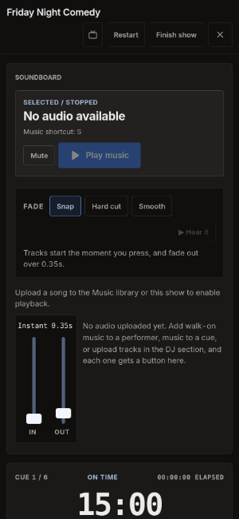
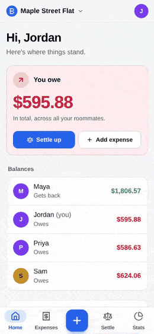
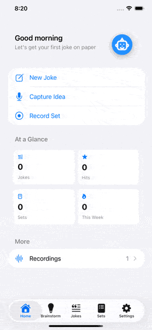
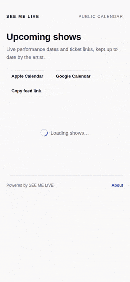
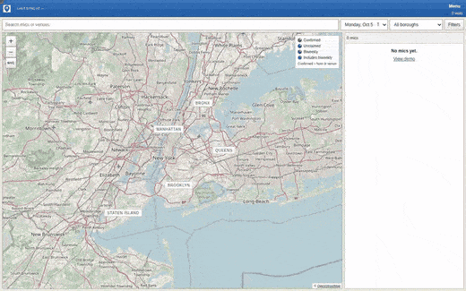
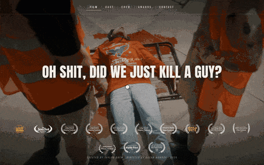

<h1 align="center">Taylor Drew</h1>

  iOS and full-stack developer. I build native SwiftUI apps and TypeScript web apps, and I ship them to real users. 
  New York City · open to full-time and contract work

  
  

---

## Highlights

- **Shipped on the App Store.** [The BitBinder](https://apps.apple.com/us/app/the-bitbinder/id6756085897) passed Apple review and ships to real users: SwiftData with CloudKit sync, on-device speech recognition, and Vision-based text import.
- **Tested like production software.** 1,000+ unit tests and 22 Playwright end-to-end specs (run on desktop and phone) in [Showrunner](https://github.com/taylordrew4u2/Showrunner-ICanRunAShow), plus client-side encryption and a documented list of known limitations.
- **Live sites, not localhost screenshots:** [icanrunashow.com](https://www.icanrunashow.com) · [rolecall.space](https://rolecall.space) · [billspilt.com](https://billspilt.com) · [the-trip-handler](https://the-trip-handler.vercel.app)
- **Payments in production.** Stripe per-person collection, invite links, and approval flows in [The Trip Handler](https://github.com/taylordrew4u2/the-trip-handler).

Every featured repo has a real README: architecture, technical decisions, setup, and trade-offs.

---

## Featured projects

### iOS

| Project | What it does | Stack |
|---|---|---|
| **[The BitBinder](https://github.com/taylordrew4u2/The-Bit-Binder)** · [App Store](https://apps.apple.com/us/app/the-bitbinder/id6756085897) | Takes stand-up material from rough idea to stage-ready set: capture, record, transcribe, import, and refine | SwiftUI, SwiftData, CloudKit, AVFoundation, Speech, Vision |
| **[My Gig Calendar](https://github.com/taylordrew4u2/MyGigCalendar)** | Calendar for live performers: enter a gig once, sync it across devices, publish it to a fan-facing calendar, and turn it into a flyer · [App Store](https://apps.apple.com/us/app/my-gig-calendar/id6760590068) | SwiftUI, CloudKit, iCalendar |
| **[VlogNudge](https://github.com/taylordrew4u2/vlognudge)** | ADHD-aware app that nudges you to film one day-in-the-life clip at a time | SwiftUI, notifications, video capture |

### Web

| Project | What it does | Stack |
|---|---|---|
| **[Showrunner](https://github.com/taylordrew4u2/Showrunner-ICanRunAShow)** · [icanrunashow.com](https://www.icanrunashow.com) | Live-show management for comedy and variety producers: build the lineup, import a schedule from a photo, and run the show with cue timers | React, TypeScript, Vite, PWA |
| **[The Trip Handler](https://github.com/taylordrew4u2/the-trip-handler)** · [demo](https://the-trip-handler.vercel.app) | Group trips end to end: invites, applications, approvals, lodging, itinerary, and Stripe-collected payments | Next.js, TypeScript, Stripe |
| **[RoleCall](https://github.com/taylordrew4u2/Role-Call)** · [rolecall.space](https://rolecall.space) | Shoot planning for filmmakers: paste a script, extract the cast, generate a shot list, build the schedule | Next.js, TypeScript, Clerk |
| **[BillSpilt](https://github.com/taylordrew4u2/Bill-Spilt)** · [billspilt.com](https://billspilt.com) | Installable roommate bill splitter that settles debts in the fewest payments and works offline | Next.js, React, TypeScript, PostgreSQL, PWA |
| **[NYC Open Mic Master List](https://github.com/taylordrew4u2/nycstandupopenmicmaster)** | Self-hosted NYC open-mic directory with source polling, a five-borough map, public corrections, and host accounts | Python, PostgreSQL |
| **[Micro-short film site](https://github.com/taylordrew4u2/micro-short-website)** | Cinematic single-page promo site for the short film *Oh Shit, Did We Just Kill a Guy?* | HTML, CSS, JavaScript |

### Desktop and audio

| Project | What it does | Stack |
|---|---|---|
| **[SobStage](https://github.com/taylordrew4u2/usbmic)** | Aggregates up to 8 USB microphones into synced multitrack recordings and a live low-latency monitor mix, with at most 0.042 ms drift over a four-hour take | C++17, CMake, real-time audio |

---

## See them run

<table>
  <tr>
    <td align="center" width="50%"> <b>Showrunner</b>: run a show with live cue timers</td>
    <td align="center" width="50%"> <b>BillSpilt</b>: add an expense, then settle up</td>
  </tr>
  <tr>
    <td align="center"> <b>The BitBinder</b>: App Store screens</td>
    <td align="center"> <b>My Gig Calendar</b>: the public fan calendar</td>
  </tr>
  <tr>
    <td align="center"> <b>NYC Open Mic Master List</b>: map, filters, mic details</td>
    <td align="center"> <b>Micro-short film site</b></td>
  </tr>
  <tr>
    <td align="center" colspan="2"> <b>SobStage</b>: 8 USB mics, one synced multitrack</td>
  </tr>
</table>

---

## Skills

- **Languages:** Swift · TypeScript · JavaScript · Python · C++
- **Apple:** SwiftUI · SwiftData · CloudKit · AVFoundation · Speech · Vision · App Store release
- **Web:** React · Next.js · Vite · PWAs · Tailwind CSS · Stripe · PostgreSQL · Vercel
- **Practices:** unit and end-to-end testing · CI · offline-first sync · client-side encryption

---

## How I work

I build for problems I actually have. The BitBinder exists because comics keep their material scattered across Notes files and voice memos. The Trip Handler exists because organizing a group trip over a group chat is chaos. Knowing the workflow first is why the tools fit it.

I ship the unglamorous parts too: auth, permissions, payments, offline sync, and App Store review. When the platform allows it, I keep user data on the device instead of sending it to a server.

---

**Contact:** [taylordrew4u@gmail.com](mailto:taylordrew4u@gmail.com). Happy to talk about iOS, full-stack TypeScript, or both.
